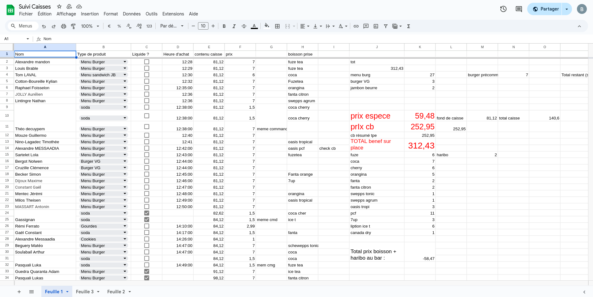

## TN'Balance

Voici une image d'un gdoc pour un suivi de caisse

C'est un peu un enfer de faire un suivi de caisse comme ça

Ca semble pas si dur de crée un petit projet en flask pour avoir un truc propre qui générer automatiquement:
 - la quantité d'argent qu'il y a en liquide dans la caisse
 - la quantité d'argent en carte reçu
 - lorsqu'on enregistre un achat on a le prix qui automatiquement enregistrer
 - les type de payments de peuvent être que soit cb soit liquide
 - les objects a vendre sont décrit quand on crée un event mais on peut en rajouter durant l'event
 - il faut savoir à qui, quoi, comment on a vendu en gros

Pour faire ça la solution très simple c'est de faire du flask avec sqlite et html + css + javascript 